# SITE-SITE-FORTIGATE

> **Autor:** Randy Nin **| Laboratorio de Redes | GNS3**

Implementación de una VPN Site-to-Site IPSec IKEv1 entre dos FortiGate, configurada íntegramente desde la interfaz gráfica (Web UI), con la configuración CLI equivalente incluida como referencia. Primer laboratorio de la serie sobre una plataforma distinta a Cisco IOS: el túnel es siempre Route-Based en FortiGate, con Phase 1, Phase 2, ruta estática y políticas de firewall como cuatro componentes independientes.

---

## Contenido del repositorio

```
SITE-SITE-FORTIGATE/
├── images/
│   ├── topology.png
│   ├── before-vpn-ping.png
│   ├── after-vpn-ping.png
│   ├── wireshark-ikev1.png
│   ├── wireshark-esp.png
│   ├── wireshark-esp-detail.png
│   ├── windows-tracert.png
│   ├── sitea-interfaces.png
│   ├── sitea-address-lan.png
│   ├── sitea-address-siteb.png
│   ├── sitea-phase1.png
│   ├── sitea-phase1-proporsal.png
│   ├── sitea-phase2.png
│   ├── sitea-static-route.png
│   ├── sitea-firewall-policy.png
│   ├── sitea-ipsec-monitor.png
│   ├── siteb-interfaces.png
│   ├── siteb-address-lan.png
│   ├── siteb-address-sitea.png
│   ├── siteb-phase1.png
│   ├── siteb-phase1-proporsal.png
│   ├── siteb-phase2.png
│   ├── siteb-static-route.png
│   ├── siteb-firewall-policy.png
│   └── siteb-ipsec-monitor.png
├── cisco-R-Site-Site
├── SITE-A.conf
├── SITE-B.conf
├── RandyNin_2025-0660_Informe_P1.md
└── README.md
```

---

## Documentación técnica

**[Documentación Tecnica Profesional VPN - Site-to-Site - FortiGate - IPSec - IKEv1 (Randy Nin -- 2025-0660).pdf](Documentación%20Tecnica%20Profesional%20VPN%20-%20Site-to-Site%20-%20%20FortiGate%20-%20IPSec%20-%20IKEv1%20(Randy%20Nin%20--%202025-0660).pdf)**

---

## Topología

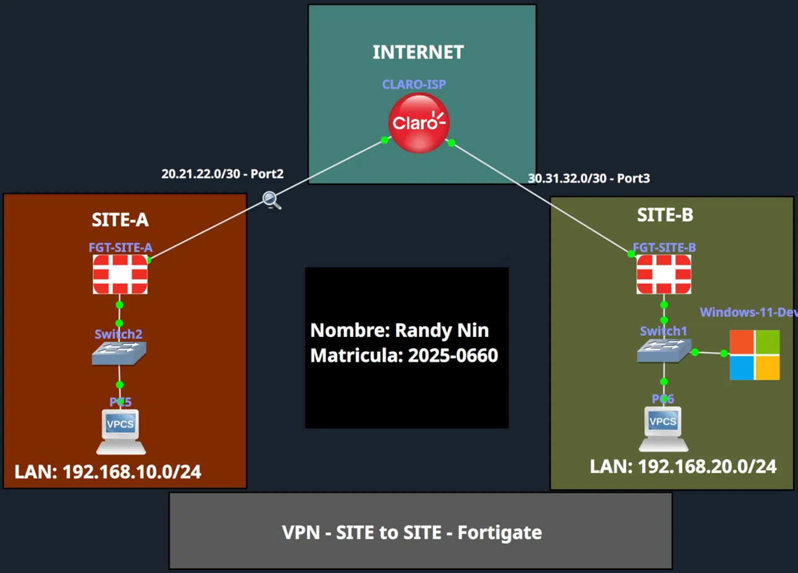

|Dispositivo|Rol|WAN IP|LAN|
|:--|:--|:--|:--|
|FGT-SITE-A|Firewall / VPN endpoint|20.21.22.1|192.168.10.0/24|
|FGT-SITE-B|Firewall / VPN endpoint|30.31.32.1|192.168.20.0/24|

---

## Las 4 piezas de un túnel IPSec en FortiGate

A diferencia de Cisco IOS (un bloque `crypto`), en FortiGate hacen falta 4 configuraciones independientes:

1. **Phase 1** (`VPN > IPsec Tunnels`): el canal IKE, remote gateway, PSK, IKE version
2. **Phase 2** (dentro del mismo túnel): selectores de tráfico (objetos de dirección) y SA de datos
3. **Ruta estática** (`Network > Static Routes`): dirige el tráfico hacia la interfaz del túnel
4. **Políticas de firewall** (`Policy & Objects > Firewall Policy`): permiten explícitamente el tráfico en ambas direcciones, ya que FortiGate deniega todo por defecto

---

## Configuración FGT-SITE-A (GUI)

**Interfaces:**


**Objetos de dirección (LAN local y SITE-B remoto):**

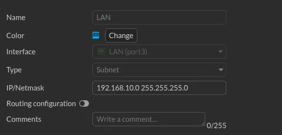 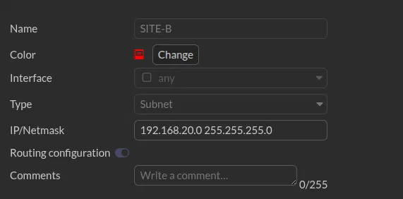

**Phase 1 (remote gateway 30.31.32.1, PSK, IKEv1 Main mode):**

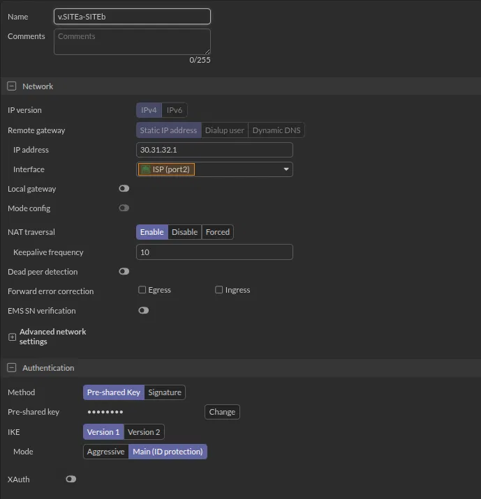

**Phase 2 (Local: LAN, Remote: SITE-B, PFS Enable, Tunnel Mode):**

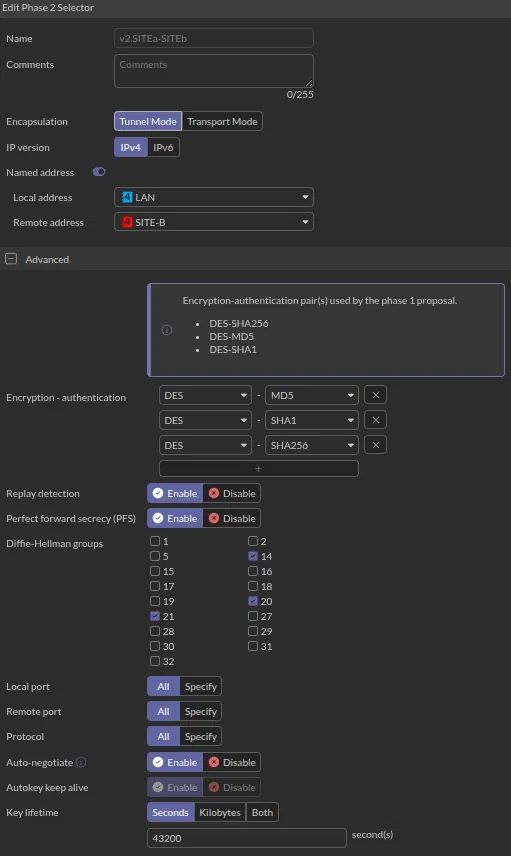

**Ruta estática hacia el túnel:**

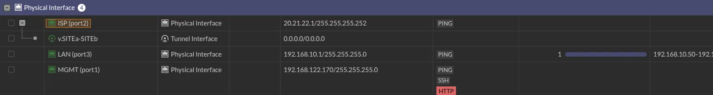

**Políticas de firewall (Internet, LAN→Túnel, Túnel→LAN):**

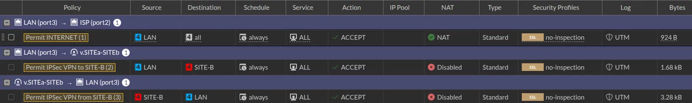

**Monitor IPsec (túnel Up):**


---

## Configuración FGT-SITE-B (GUI)

Simétrica a FGT-SITE-A. Ver la sección 6 del informe técnico para las asimetrías puntuales encontradas entre ambos extremos (grupos DH, `net-device`, y una política a revisar).

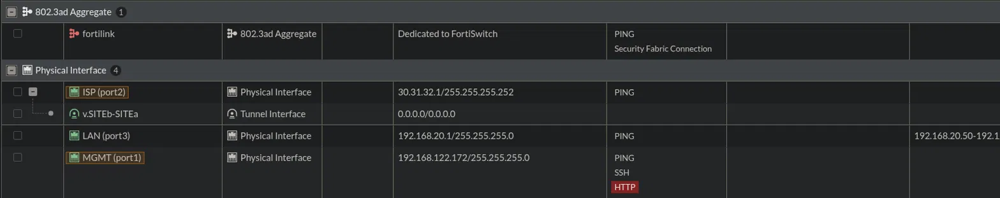 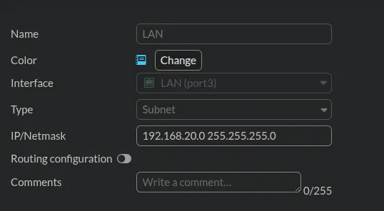 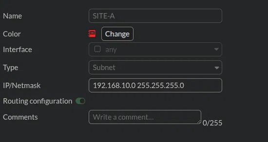 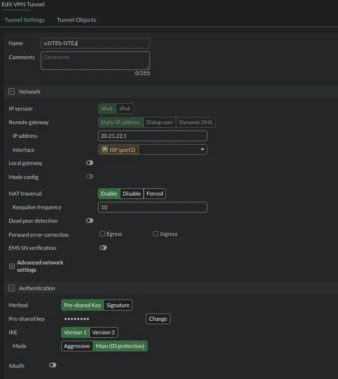 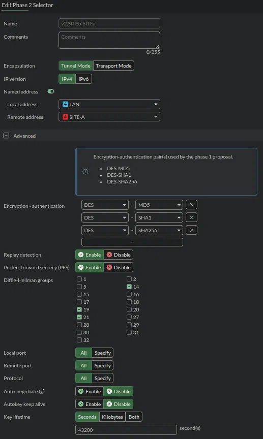  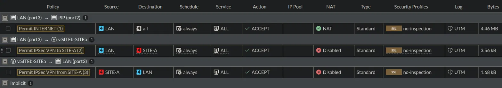 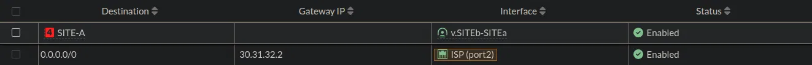

---

## Configuración CLI equivalente

Archivos completos: [`SITE-A.conf`](./SITE-A.conf) y [`SITE-B.conf`](./SITE-B.conf) (exportación completa de FortiOS). Bloques relevantes:

```
config vpn ipsec phase1-interface
    edit "v.SITEa-SITEb"
        set interface "port2"
        set proposal des-sha256 des-md5 des-sha1
        set dhgrp 21 20 14
        set remote-gw 30.31.32.1
    next
end

config vpn ipsec phase2-interface
    edit "v2.SITEa-SITEb"
        set phase1name "v.SITEa-SITEb"
        set dhgrp 14 20 21
        set auto-negotiate enable
        set src-name "LAN"
        set dst-name "SITE-B"
    next
end

config router static
    edit 2
        set device "v.SITEa-SITEb"
        set dstaddr "SITE-B"
    next
end
```

---

## Antes de la VPN: sin conectividad

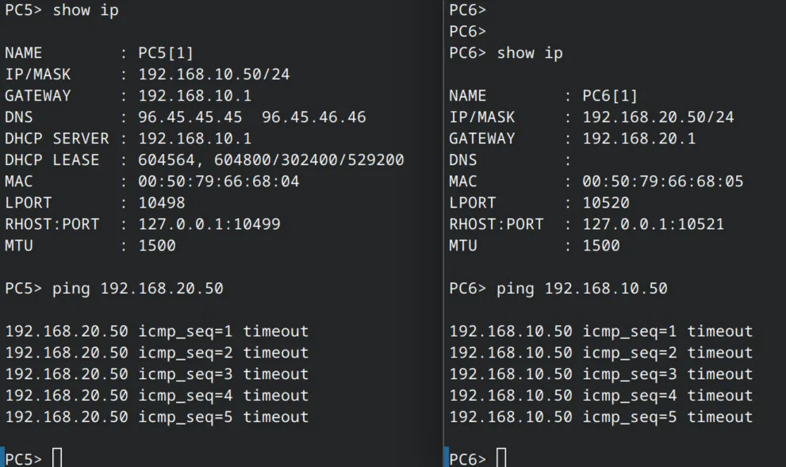

---

## Negociación IKEv1

9 mensajes (6 Main Mode + 3 Quick Mode), idéntico al patrón de todos los laboratorios Cisco de la serie.

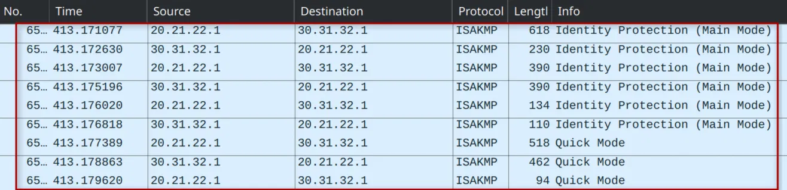

---

## Tráfico ESP cifrado

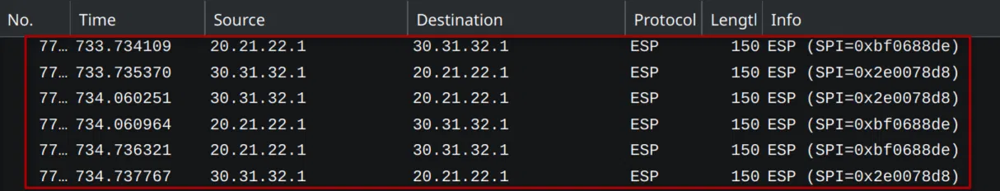

---

## Conectividad establecida

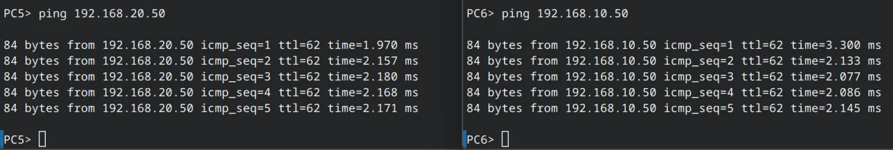

**Traceroute desde el cliente Windows real:**

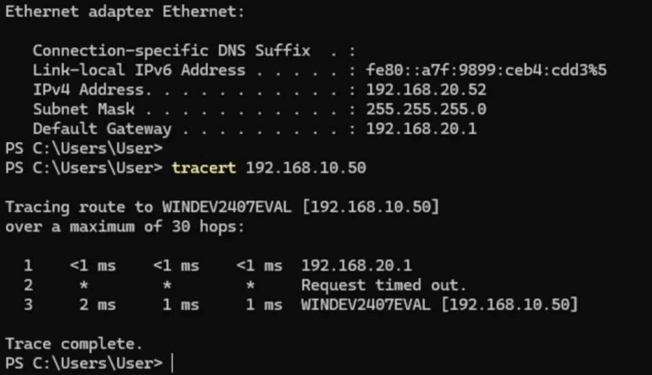

---

## Observación importante

En la configuración exportada de FGT-SITE-A, la política `Permit IPSec VPN from SITE-B` (tráfico nuevo iniciado desde SITE-B) aparece deshabilitada. Revisar antes de reutilizar este repo como base si se necesita que ambos sitios puedan iniciar conexiones nuevas indistintamente. Ver sección 9 del informe técnico para el detalle completo.

---

## Video demostrativo

**LINK:** [https://youtu.be/NWtggPjLtzY](https://youtu.be/NWtggPjLtzY)

---

_Randy Nin / Matrícula 2025-0660_

---

